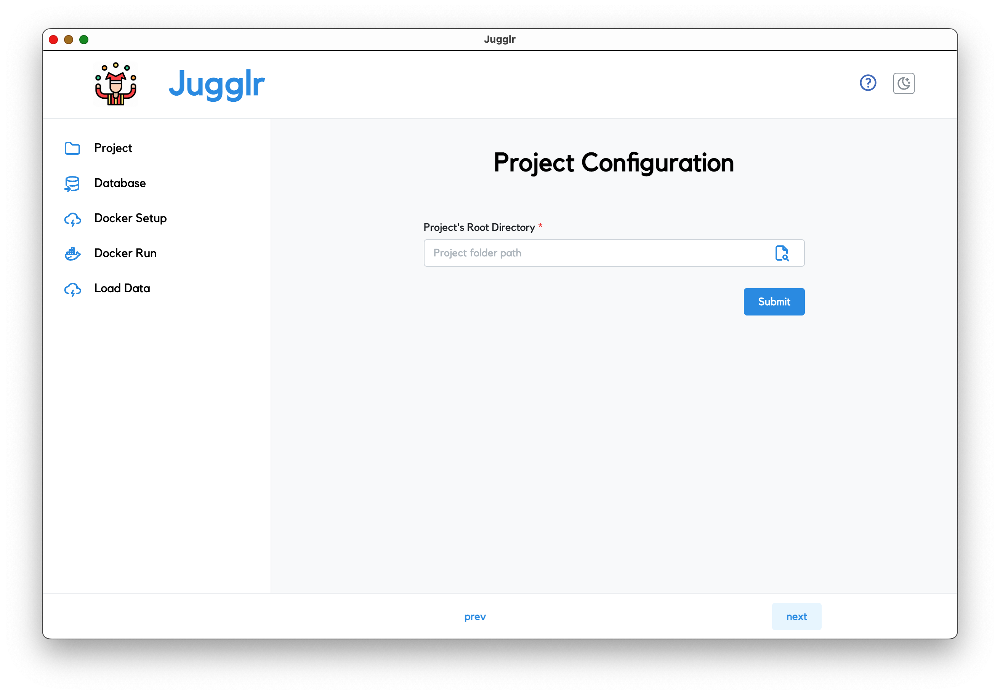
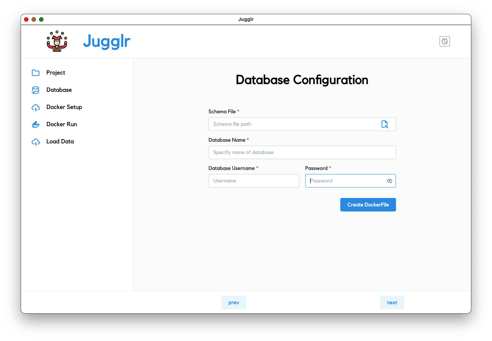
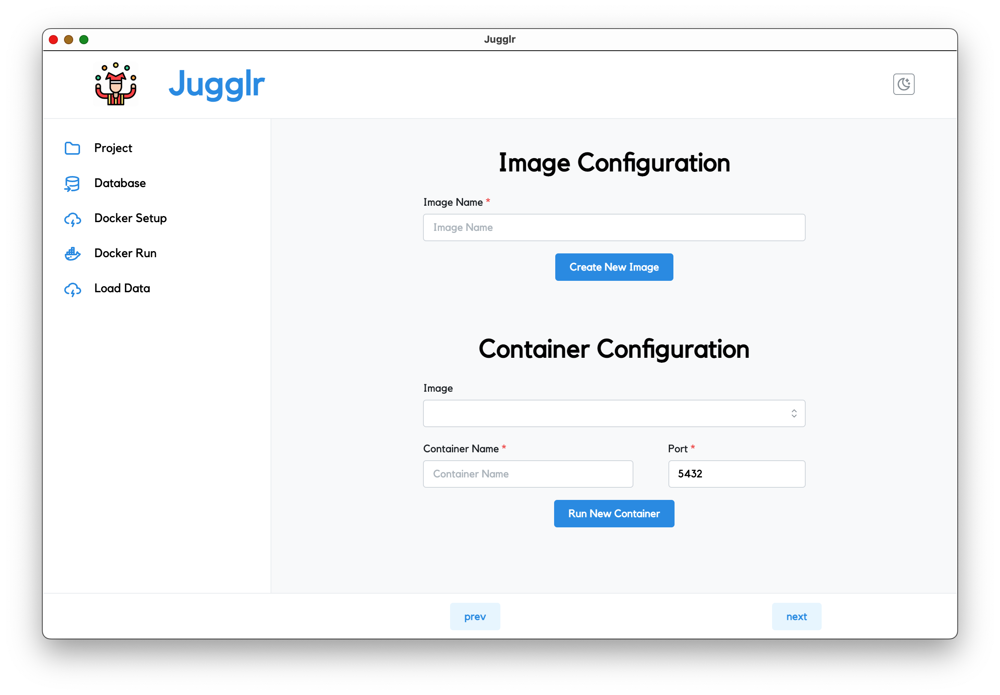
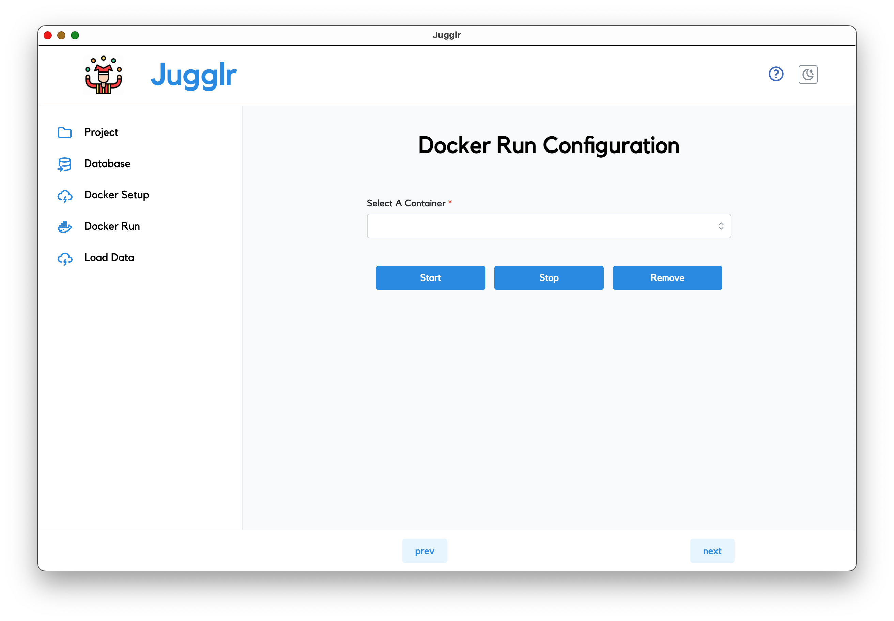
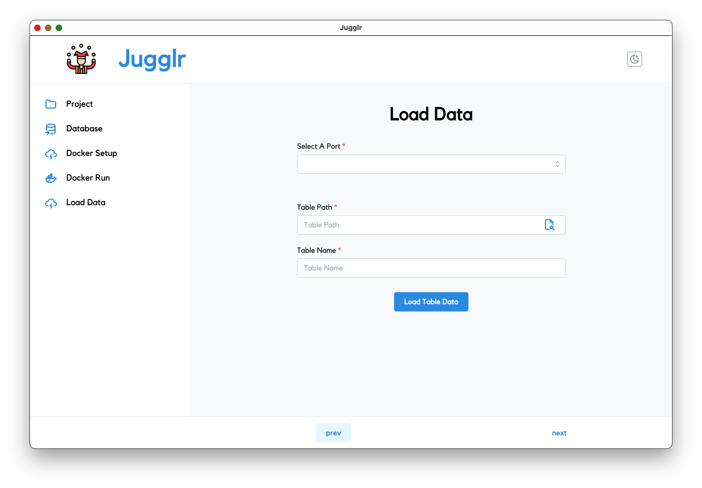

# Jugglr
Jugglr is a tool for managing test data and running tests with a lightweight, dedicated database. The database runs in a Docker container so as not to interfere with any other processes or databases. When testing is done, the data can be retained for investigating any issues that were found, then erased and replaced for the next run.

Jugglr takes in information about your project root directory along with database details, then uses that information to create a Dockerfile in your project. From there, you can use Jugglr to create a Docker image, run the image in a container, and bulk load table data from a CSV file to the deployed database. When creating an image, Jugglr will use whatever sql file you supply to set up the database. Meaning, you can use a dump file to load the database schema along with data, load just the schema, or anything in between.

In order to make use of Jugglr, you must also be running Docker. Docker can be installed locally by downloading Docker Desktop from https://www.docker.com/get-started/. Jugglr currently supports running a PostgreSQL database. It is recommended that you have a separate tool for any database interaction you may want to do outside of your tests. 

The first step in using Jugglr is to provide the root directory of the repository containing your tests. This enables Jugglr to create your Dockerfile within the project itself, so that it can be saved with your project code. 

The next step is to provide information for creating the database. Here you will enter the location of a sql schema file to initialize the database with, as well as the database name, superuser account name, and password for the database. Then just click the button to create a Dockerfile. If you previously created a Dockerfile with Jugglr, no need to re-enter the information. Jugglr will pre-populate it for you. You can proceed immediately to the next steps, or change any details you wish and create a new Dockerfile.

Once you have a Dockerfile, you can create a Docker image. All that is required here is for you to give your image a name, Jugglr takes care of the rest. This also need only be done once, unless you want to change the database schema. For any database changes, it is recommended that you create a new image to capture the changes.
NOTE: image names must be lowercase and have no spaces. Anything else will cause the image build to fail.

  

Having created the image (either for the first time or on any subsequent use), all that is left is to run the image in a container. The first time, you must enter information about the container. Any subsequent time, you will just start or stop the container (this can be done on the next tab of the app, ‘Docker Run’). You begin by selecting the image to run from. Then, give the container a name and if desired, specify a port. The port is defaulted to 5432, which is standard for the database, but you may change it if you wish (if, for example, you want to run multiple databases at once). If you do change the port, make sure your application is properly configured to use that port when connecting to the database. Note that if you want to start with fresh data, you would need to create a new container. If you want to resume testing with any prior changes, you would start an existing container. 

Finally, with your database now running in a container, you can load some data. You will bulk-load data from a csv file directly to your table, by supplying the path to your csv file and the table name. Jugglr takes care of the rest. 

When configuring database details in your application, use ‘localhost’ as the hostname/server, 5432 as the port (or whatever port you chose), and the database name, username, and password that you chose.

Happy testing!